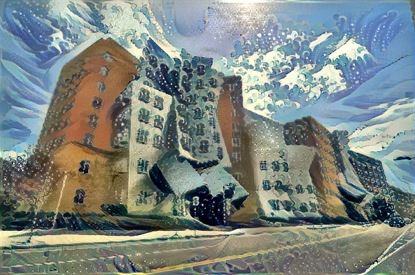

# Neural Style Transfer 

This is an implementation of the style transfer algorithm in Keras. The algorithm can be used to mix the content of an image with the style of another image.

## Requirements

- Python 3
- [Keras](https://keras.io/) 
- [Tensorflow (backend)](https://www.tensorflow.org/) 
- [Numpy](http://www.numpy.org/) & [Scipy](https://www.scipy.org/) 
- A GPU is not necessary, but can provide a significant speed up. 

## References

- Leon A. Gatys, ["A Neural Algorithm of Artistic Style"](https://arxiv.org/pdf/1508.06576.pdf)
- Francois Chollet, ["Neural Style Transfer with Keras"](https://github.com/keras-team/keras/blob/master/examples/neural_style_transfer.py)
